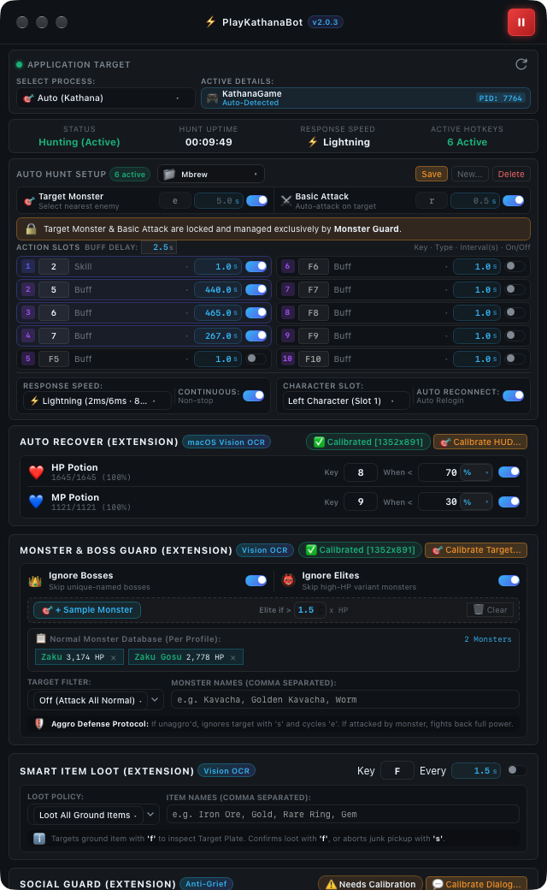

<div align="center">

# ⚔️ PlayKathanaBot

### Background Auto-Hunt Automation for macOS & Windows

Run your hunt continuously while you work, browse, code, or use other applications.

[](#-download)
[](../../releases)

</div>

---

## 📖 Overview

**PlayKathanaBot** is a desktop automation application for continuous **Auto Hunt** with background input support on **macOS and Windows**.

Keep your character hunting while continuing to use your computer normally:

* 💻 Work in your IDE
* 🌐 Browse the web
* 💬 Use chat applications
* 🎮 Use other applications
* ⚔️ Keep Auto Hunt running in the background

PlayKathanaBot provides configurable hunting actions, skill and buff timers, smart guards, automatic recovery, reconnect functionality, and live statistics.

---

## ✨ Key Features

### ⚔️ Auto Hunt

* Target Monster automation
* Basic Attack automation
* Configurable intervals
* Multiple action and skill slots
* Custom hotkeys
* Sequential action execution
* Skill & buff timers
* Continuous / non-stop hunting

### 🎛️ Configuration Profiles

Create and switch between multiple hunting configurations.

Each profile can store:

* Hotkeys
* Skill timers
* Buff configuration
* Hunt settings
* Guard settings
* Character configuration
* Reconnect settings

### 🛡️ Smart Guard

Protection features designed to reduce unintended interactions while Auto Hunt is running.

* Smart Guard
* Monster / Elite detection
* Social interaction protection
* Context-menu protection
* Background input handling

### 👹 Smart Monster Guard

Configurable handling for supported target conditions:

* Elite monsters
* Boss targets
* Target changes
* HP-based conditions

### 🔄 Auto Reconnect

Recover from supported disconnect or game restart scenarios.

* Detect supported disconnect / termination
* Relaunch the game
* Wait for the game to become available
* Continue the reconnect workflow
* Restore the configured hunting workflow

**Character Slot** is integrated with Auto Relogin to determine which character configuration is used during reconnect.

### 👁️ Auto Recover

OCR-based detection for supported game states and recovery scenarios.

Available on:

* macOS
* Windows

### 💰 Smart Loot

Automate supported loot-related actions during hunting to reduce manual interaction.

### 📊 Live Statistics

Monitor the current session:

* Hunt status
* Hunt uptime
* Response speed
* Active hotkeys
* Reconnect status
* Guard status
* Activity logs

---

## 🖥️ Platform Support

| Platform   |      Architecture     |    Status   |
| :--------- | :-------------------: | :---------: |
| 🍎 macOS   | Apple Silicon + Intel | ✅ Supported |
| 🪟 Windows |      x64 + ARM64      | ✅ Supported |

### 🍎 macOS

* macOS 12 Monterey or newer
* Apple Silicon or Intel Mac
* Accessibility permission
* Internet connection for account and subscription verification

### 🪟 Windows

* Windows 10 or Windows 11
* x64 or ARM64 system
* Internet connection for account and subscription verification

---

# 📥 Download

Download the latest version from **GitHub Releases**.

**[⬇️ Download Latest Release](../../releases/latest)**

### 🍎 macOS

**Universal — Apple Silicon + Intel**

```text
PlayKathanaBot-macOS.zip
```

The package contains:

```text
PlayKathanaBot.app
```

### 🪟 Windows

| Build | File                       |
| :---- | :------------------------- |
| x64   | `PlayKathanaBot.exe`       |
| ARM64 | `PlayKathanaBot_arm64.exe` |

Windows builds are portable and do not require a traditional installer.

**[📦 View All Releases](../../releases)**

---

# 🚀 Installation

## 🍎 macOS

1. Download `PlayKathanaBot-macOS.zip`.
2. Extract the ZIP file.
3. Move `PlayKathanaBot.app` to `/Applications`.
4. Launch PlayKathanaBot.
5. Grant **Accessibility** permission.

Open:

```text
System Settings
→ Privacy & Security
→ Accessibility
```

Enable **PlayKathanaBot**, then restart the application if necessary.

> macOS may display a security warning for applications downloaded from the internet. Follow the system prompt if it appears.

---

## 🪟 Windows

1. Download the correct `.exe` for your architecture.
2. Place it in your preferred folder.
3. Launch `PlayKathanaBot.exe`.
4. Sign in.
5. Configure your hunt profile.
6. Start Auto Hunt.

If the target game runs with elevated privileges, PlayKathanaBot may also need to be launched with the appropriate Windows permissions.

---

# 🔐 Account & Subscription

PlayKathanaBot requires an account and an active subscription for subscription-protected hunting features.

### Sign In

Sign in using your supported account directly from the application.

### Subscription Status

| Status       | Access                           |
| :----------- | :------------------------------- |
| 🟢 Active    | Hunting features available       |
| 🟡 Expired   | Protected features locked        |
| 🔴 Not Found | Subscription activation required |

The application verifies subscription status when required.

### Device Limit

Depending on your subscription plan, the number of active devices may be limited.

If your account is already active on another device, deactivate the previous device before activating a new one.

---

# ⚡ Response Speed

Choose from four configurable response profiles:

| Profile      | Timing | Description                |
| :----------- | :----: | :------------------------- |
| ⚡ Lightning  |   8ms  | Fastest response           |
| 🚀 Ultra     |  14ms  | High-speed response        |
| ⚖️ Balanced  |  24ms  | Balanced performance       |
| 🛡️ Reliable |  37ms  | More conservative response |

Actual response behavior may vary depending on system performance, operating system conditions, and target application behavior.

---

# 🖼️ Interface

<p align="center">
  
</p>

The interface provides quick access to:

* 🎯 Application targeting
* ⚔️ Hunt configuration
* ⌨️ Skill / action management
* ⚡ Response Speed
* 🔄 Continuous Send
* 🛡️ Smart Guard
* 👹 Monster Guard
* 💬 Social Guard
* 🎮 Character Slot
* 🔄 Auto Relogin
* 👁️ Auto Recover
* 💰 Smart Loot
* 📊 Live Statistics
* 📋 Activity Logs

---

# 📋 Feature Overview

| Feature                 | macOS | Windows |
| :---------------------- | :---: | :-----: |
| Background Auto Hunt    |   ✅   |    ✅    |
| Target Monster          |   ✅   |    ✅    |
| Basic Attack            |   ✅   |    ✅    |
| Action Slots            |   ✅   |    ✅    |
| Custom Hotkeys          |   ✅   |    ✅    |
| Skill & Buff Timers     |   ✅   |    ✅    |
| Sequential Pre-Buff     |   ✅   |    ✅    |
| Continuous Send         |   ✅   |    ✅    |
| Configuration Profiles  |   ✅   |    ✅    |
| Response Speed Profiles |   ✅   |    ✅    |
| Smart Guard             |   ✅   |    ✅    |
| Monster Guard           |   ✅   |    ✅    |
| Social Guard            |   ✅   |    ✅    |
| Context Protection      |   ✅   |    ✅    |
| Auto Recover            |   ✅   |    ✅    |
| Auto Reconnect          |   ✅   |    ✅    |
| Character Slot          |   ✅   |    ✅    |
| Smart Loot              |   ✅   |    ✅    |
| Live Statistics         |   ✅   |    ✅    |
| Diagnostic Logging      |   ✅   |    ✅    |

---

# 🆕 Releases & Changelog

All official builds, release notes, bug fixes, and improvements are published through GitHub Releases.

**[📦 View Latest Release](../../releases/latest)**

Each release may include:

* ✨ New features
* 🐛 Bug fixes
* ⚡ Performance improvements
* 🔧 Stability improvements
* 🖥️ Compatibility improvements
* 🎨 UI improvements

---

# ❓ Troubleshooting

### 🍎 macOS — Auto Hunt does not send input

Check:

```text
System Settings
→ Privacy & Security
→ Accessibility
→ PlayKathanaBot
```

Make sure Accessibility permission is enabled, then restart the application.

### 🪟 Windows — Game does not respond

Try:

1. Restart PlayKathanaBot.
2. Verify the target application is running.
3. Check the selected target and action configuration.
4. Try **Balanced** or **Reliable** response speed.
5. If the game requires elevated privileges, launch PlayKathanaBot with the appropriate permissions.

### 🔐 Subscription cannot be verified

Check:

* Internet connection
* Signed-in account
* Subscription status
* Correct account

Then sign out, restart the application, and sign in again.

### 🔄 Auto Relogin does not work

Verify:

```text
Character Slot
      ↓
Correct character selected
      ↓
Auto Relogin enabled
      ↓
Reconnect configuration
```

### 👁️ Auto Recover does not trigger

Make sure:

* Auto Recover is enabled
* The detected state is supported
* The target application is available to the detection system
* The active profile has the correct configuration

---

# 🔒 Privacy & Security

This public repository contains only distribution-related content:

* 📖 Documentation
* 🖼️ Application assets
* 📦 Release information
* 💻 Compiled application binaries

The application source code and internal development configuration are maintained separately.

Never share account credentials, authentication information, or private access tokens.

Only download PlayKathanaBot from the official Releases page.

---

# 📁 Repository Structure

```text
play-kathana-bot-download/
│
├── README.md
│
├── assets/
│   └── app_preview.png
│
└── GitHub Releases
    ├── v2.x.x
    │   ├── PlayKathanaBot-macOS.zip
    │   ├── PlayKathanaBot.exe
    │   └── PlayKathanaBot_arm64.exe
    │
    └── ...
```

The source code is maintained in a separate private repository.

---

# 🔄 Updating

### macOS

1. Download the latest release.
2. Close PlayKathanaBot.
3. Replace the existing application in `/Applications`.
4. Launch the new version.
5. Re-confirm Accessibility permission if requested.

### Windows

1. Download the latest `.exe`.
2. Close PlayKathanaBot.
3. Replace the existing executable.
4. Launch the new version.

Your account and subscription are managed independently from the application binary.

---

# 🗑️ Uninstallation

### 🍎 macOS

Delete:

```text
/Applications/PlayKathanaBot.app
```

### 🪟 Windows

Delete the downloaded executable:

```text
PlayKathanaBot.exe
```

or:

```text
PlayKathanaBot_arm64.exe
```

No traditional uninstaller is required.

---

# ⚠️ Important Notes

* PlayKathanaBot is distributed as compiled software.
* Download binaries only from the official Releases page.
* Choose the correct build for your operating system and architecture.
* An active subscription may be required for protected features.
* Application behavior may vary depending on system and target application conditions.
* Some features depend on the configuration and capabilities of the target application.
* Use PlayKathanaBot in accordance with the rules and policies applicable to the software or service being automated.

---

# 📄 License & Usage

PlayKathanaBot is distributed as proprietary software.

The source code is maintained separately and is not included in this public repository.

Unless explicitly authorized by the software owner, users may not:

* Redistribute modified binaries
* Modify or repackage the application
* Sell or redistribute PlayKathanaBot binaries
* Remove application ownership information
* Claim ownership of the software
* Use PlayKathanaBot binaries as part of another commercial product

---

<div align="center">

### ⚔️ PlayKathanaBot

**Hunt continuously. Work normally.**

**[⬇️ Download Latest Release](../../releases/latest)**

</div>