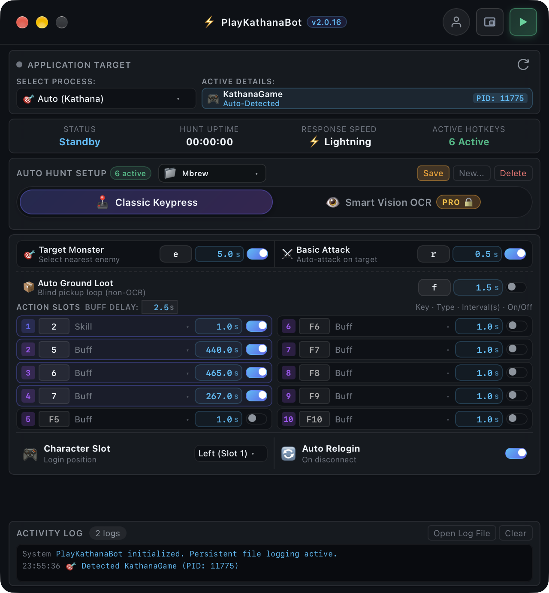
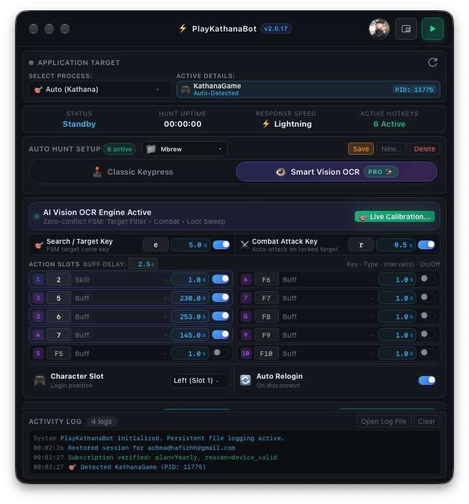
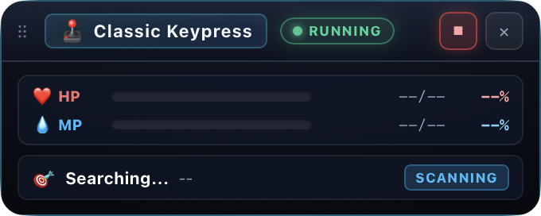

<div align="center">

# ⚔️ PlayKathanaBot

### Background Auto-Hunt Automation for macOS & Windows
**Zero Focus Stealing • Dual-Mode Engine • Floating Mini-HUD • Adaptive Auto Reconnect**

Keep your hunt running while you work, browse, code, or use other apps.

[](#download)
[](#free-tier-vs-pro-tier)

<p align="center">
  <a href="#overview">Overview</a> •
  <a href="#dual-mode">Dual-Mode Engine</a> •
  <a href="#mini-hud">Mini-HUD</a> •
  <a href="#key-features">Key Features</a> •
  <a href="#download">Download</a> •
  <a href="#installation">Installation</a> •
  <a href="#free-tier-vs-pro-tier">Free vs PRO</a> •
  <a href="#troubleshooting">Troubleshooting</a>
</p>

---

</div>

<a id="overview"></a>
## 📖 Overview

**PlayKathanaBot** is a desktop automation companion for hands-free **Auto Hunt** with background input support on **macOS and Windows**.

It is designed to run quietly alongside your other apps. You can type emails, work in your editor, browse the web, or use another window while automation keeps running in the background.

> [!IMPORTANT]
> **Zero Focus Stealing**: your active typing cursor stays where it is. No window flicker, no lost focus, and context menus in your other apps keep working normally.

---

<a id="dual-mode"></a>
## 🕹️ Dual-Mode Engine

Choose between a lightweight offline classic mode and an advanced vision-assisted mode:

<p align="center">
  
  
</p>

| Mode | Best For | Account | What's Included |
| :--- | :--- | :--- | :--- |
| **🕹️ Classic** | Everyone | **None (Free Tier)** | Target & Attack timers, Auto Ground Loot, 10 Action Slots, Sequential Pre-Buff, Floating Mini-HUD, Adaptive Auto Reconnect. **Free & Offline**. |
| **👁️ Smart Vision** | Power users | **Sign-In + PRO Tier** | Everything in Classic, plus Auto Recover HP/MP, Target Whitelist, Elite/Boss filtering, Smart Loot Sweep, and Social Dialog Guard. |

---

<a id="mini-hud"></a>
## 🪟 Floating Always-on-Top Mini-HUD

Use the **Dock / Float** button in the title bar to shrink the full window into a compact floating widget:

<p align="center">
  
</p>

- **Compact footprint** that stays out of your way.
- **Stays on top** across both macOS and Windows, with automatic corner snapping.
- **Live telemetry**: status pill (`RUNNING` / `STANDBY`), HP & MP gauges, target state, activity indicator, and quick Stop / Restore controls.

---

<a id="key-features"></a>
## ✨ Key Features

### ⚔️ Auto Hunt & Action Grid
* **Target & Attack**: independent timers with custom hotkeys.
* **10 Action Slots**: secondary skill/buff slots in a tidy 2-column layout, supporting alphanumeric keys, function keys, and common special keys.
* **Flexible Timers**: fine-grained interval control.
* **Sequential Pre-Buff**: casts your active buffs in order when a hunt starts, with a configurable delay between casts.
* **Auto Ground Loot**: paced background pickup loop with a configurable interval.
* **Continuous Operation**: keeps running in the background without interruption.

### 🎛️ Configuration Profiles
* Create, save, switch, and delete multiple hunting profiles.
* Quick in-app profile switching without restarting.
* Remembers and restores your last active profile on launch.

### 🔄 Adaptive Auto Reconnect
* Recovers automatically after a disconnect or crash.
* Relaunches the game, reconnects, and selects your configured character slot.
* **Resolution-aware**: adapts to common display aspect ratios including **4:3**, **16:9**, and ultrawide **21:9**.

### 👁️ Smart Vision (PRO Tier)
* **Auto Recover**: watches your HP/MP and triggers recovery when needed.
* **Elite & Boss Awareness**: recognizes tougher targets and adjusts behavior.
* **Smart Loot Sweep**: focused loot pickup instead of blind repetition.
* **Social Dialog Guard**: handles in-game invitation and duel prompts for you.

### 🛡️ Multitasking Protection
* Background input delivery designed to avoid stealing focus from your other apps.
* Right-click and context menus in your other apps stay intact while automation runs.

### 📊 Live Stats & Logging
* Live session metrics: status, uptime, response profile, and active hotkey count.
* In-app activity log kept lightweight to stay smooth over long sessions.
* Persistent, timestamped logs with automatic rotation.

---

<a id="platform-support"></a>
## 🖥️ Platform Support

| Platform   | Architecture | Status |
| :--------- | :----------: | :----: |
| 🍎 **macOS**   | Apple Silicon (M1–M4) + Intel | ✅ Supported |
| 🪟 **Windows** | x64 + ARM64 | ✅ Supported |

### 🍎 macOS Requirements
* macOS 12 Monterey or newer
* Apple Silicon or Intel Mac
* Accessibility permission enabled (`System Settings → Privacy & Security → Accessibility`)
* Screen Recording permission (only for Smart Vision mode)

### 🪟 Windows Requirements
* Windows 10 or Windows 11 (64-bit x64 or ARM64)
* No extra runtime installation needed
* Administrator rights may be required if the target game runs elevated

---

<a id="download"></a>
# 📥 Download

Download the latest official build from **GitHub Releases**.

**[⬇️ Download Latest Release](../../releases/latest)**

### 🍎 macOS
```text
PlayKathanaBot_macos.zip
```
Extracting the package yields `PlayKathanaBot.app`.

### 🪟 Windows
Windows builds are portable and do not require an installer:

| Architecture | Download |
| :----------- | :-------------- |
| **x64** (Intel / AMD 64-bit) | `PlayKathanaBot_x64.exe` |
| **ARM64** (Surface Pro, Snapdragon X) | `PlayKathanaBot_arm64.exe` |

**[📦 View All Releases](../../releases)**

---

<a id="installation"></a>
# 🚀 Installation

## 🍎 macOS

1. Download `PlayKathanaBot_macos.zip`.
2. Extract the archive.
3. Move `PlayKathanaBot.app` to `/Applications`.
4. Launch the app.
5. Grant **Accessibility** permission:
   ```text
   System Settings → Privacy & Security → Accessibility → Enable PlayKathanaBot
   ```
6. *(Optional — for Smart Vision)* Grant **Screen Recording** permission if prompted.

> [!NOTE]
> If macOS shows a Gatekeeper prompt, right-click `PlayKathanaBot.app`, choose **Open**, and confirm.

---

## 🪟 Windows

1. Download `PlayKathanaBot_x64.exe` (or `PlayKathanaBot_arm64.exe`).
2. Move it to your preferred folder.
3. Right-click the `.exe` and choose **Run as administrator** (recommended if the target game runs elevated).
4. Select your target and start.

---

<a id="free-tier-vs-pro-tier"></a>
# 🔐 Free Tier vs. PRO Tier

| Capability | Free (Classic) | PRO (Smart Vision) |
| :--- | :---: | :---: |
| **Account Required** | ❌ None | ✅ Yes |
| **Offline** | 🌐 Yes | 🌐 Verification required |
| **Target & Attack** | ✅ | ✅ |
| **10 Action Slots** | ✅ | ✅ |
| **Sequential Pre-Buff** | ✅ | ✅ |
| **Auto Ground Loot** | ✅ | ✅ |
| **Floating Mini-HUD** | ✅ | ✅ |
| **Adaptive Auto Reconnect** | ✅ | ✅ |
| **Profile Manager** | ✅ | ✅ |
| **Auto Recover (HP/MP)** | 🔒 | ✅ |
| **Elite & Boss Awareness** | 🔒 | ✅ |
| **Smart Loot Sweep** | 🔒 | ✅ |
| **Social Dialog Guard** | 🔒 | ✅ |

### Device Limit (PRO Tier)
* PRO licenses allow **1 active device** at a time. Sign out from your current device before moving to another.
* Built-in session resilience keeps brief network hiccups from interrupting your session.

---

<a id="response-speed-profiles"></a>
# ⚡ Response Speed Profiles

Pick a timing profile to match your system and game responsiveness:

| Profile | Description |
| :--- | :--- |
| ⚡ **Lightning** | **Recommended**. Fastest, most responsive. |
| 🚀 **Ultra** | High-speed, smooth input cycles. |
| ⚖️ **Balanced** | Steadier under heavy multitasking or moderate lag. |
| 🛡️ **Reliable** | Conservative; best for slower or busy systems. |

---

<a id="troubleshooting"></a>
# ❓ Troubleshooting

### 🍎 macOS — Auto Hunt sends no input
1. Open **System Settings → Privacy & Security → Accessibility**.
2. Make sure **PlayKathanaBot** is checked.
3. If it stopped working after an update, toggle the switch off and on again, then restart the app.

### 🪟 Windows — Target game doesn't respond
1. **Run as Administrator** if the game runs elevated.
2. Try switching the **Response Speed** to `⚖️ Balanced` or `🛡️ Reliable`.

### 🔐 Subscription / Account
* **Classic mode** is free and works offline — no login required.
* For **Smart Vision (PRO)**, make sure you are signed in to the right account, your connection is stable, and the account isn't active on another machine (1 device limit).

### 🔄 Auto Reconnect & Resolution
* Adaptive scaling supports **4:3**, **16:9**, and **21:9** displays.
* Run your game in windowed or borderless fullscreen matching a standard aspect ratio.

---

<a id="updating"></a>
# 🔄 Updating

### macOS
1. Download the latest `PlayKathanaBot_macos.zip`.
2. Quit any running instance.
3. Extract and overwrite `/Applications/PlayKathanaBot.app`.
4. Relaunch.

### Windows
1. Download the latest `.exe`.
2. Quit the running instance.
3. Replace the existing executable.
4. Relaunch.

---

<a id="uninstallation"></a>
# 🗑️ Uninstallation

* **macOS**: move `/Applications/PlayKathanaBot.app` to the Trash.
* **Windows**: delete the executable and the generated profiles folder. No registry entries or services are left behind.

---

<a id="license-usage"></a>
# 📄 License & Usage

PlayKathanaBot is distributed as proprietary compiled software.

Unless explicitly authorized, users may not:
* Reverse engineer, decompile, or modify the binaries.
* Redistribute or sell the binaries.
* Remove proprietary copyright or branding notices.

---

<div align="center">

### ⚔️ PlayKathanaBot

**Hunt continuously. Work normally.**

**[⬇️ Download Latest Release](../../releases/latest)**

</div>
